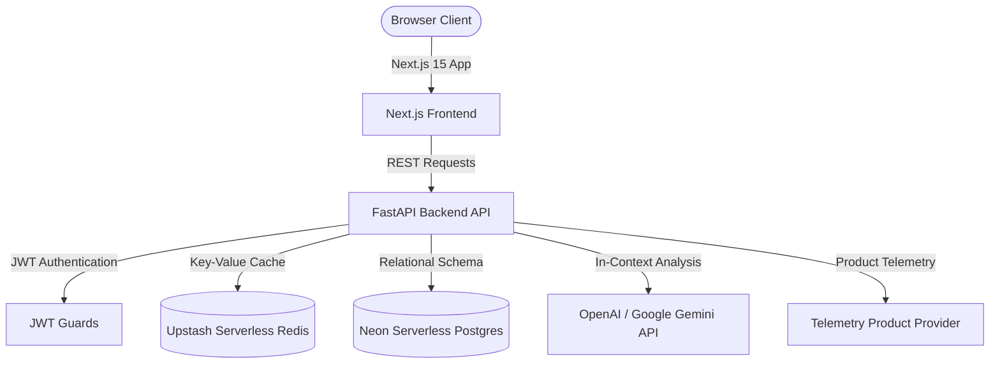

# BuyWise 2.0 — AI-Powered Purchase Intelligence SaaS

BuyWise is a high-performance full-stack web application designed to help consumers make confident purchasing decisions and avoid buyer's remorse. By aggregating reviews, forum sentiment, and specifications in real time, BuyWise parses telemetry indicators into definitive metrics: **Buy Score, Regret Score, and Community Trust Ratings**.

---

## 🗺️ System Architecture



---

## 📂 Project Structure

```text
buywise-v2/
├── apps/
│   ├── web/           # Next.js 15 Frontend (Vite/TypeScript, Tailwind, framer-motion)
│   └── api/           # FastAPI Backend Service (SQLAlchemy, Uvicorn, OpenAI/Gemini integration)
├── packages/
│   └── database/      # Database migrations and configuration schemas
├── .gitignore         # Root file mapping ignored folders (node_modules, .venv, .next)
├── README.md          # Project developer documentation
└── docker-compose.yml # Local services configuration file (Web, API, Postgres, Redis)
```

---

## ⚡ Technologies

*   **Frontend**: Next.js 15, TypeScript, Tailwind CSS, Lucide icons, Framer Motion, Recharts.
*   **Backend**: Python, FastAPI, Pydantic v2, SQLAlchemy, Uvicorn.
*   **Databases**: PostgreSQL (SQLAlchemy ORM), Redis (caching and logs).
*   **AI Models**: OpenAI (gpt-4o-mini) and Google Gemini (gemini-1.5-flash) compatibility.

---
